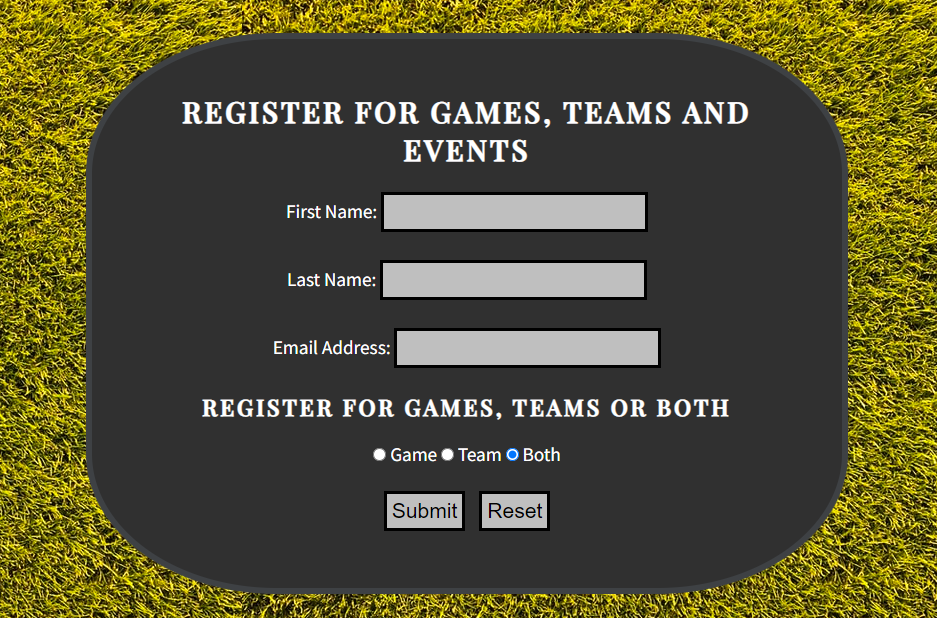
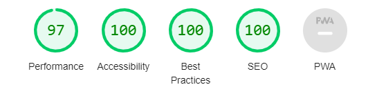

___
# **Find Me Football**

'Find Me Football' is a website for anyone who wants to play football in the Manchester area. There are two aspects of the website; one for people who are looking to play a game of football, and one for people who are looking to join a local football team. It happens very often that people are new to an area, or haven't played football for a long time, and don't know where to start to get back playing. Perhaps they don't know enough people to organise their own game, can't commit to a football league and so they just want to be able to join a game, or team, at a time and date that suits them. Find me football provides users with a simple way to register interest in joining a football game, or team, with everything being coordinated for them. 

___
___
## **Motivation** ##
I have been in the situation myself where I have been new to an area, unfit and not enough friends to be able to go out and play a game of football. I have never played for a football team because I have never been brave enough to go to trials for a team because I didn't know if i would be good enough, fit enough or even in a position to commit to a team. Find Me Football would have been that website that provided me a way of doing any of them with the help of everyone else being in the same boat.
___
___

## **Features** ##
___

### **Fixed Navigation Bar** ###

The fixed navgation bar will be fixed to the top of the screen so that the user will have access to all of the sites pages at anyyime. The navigation bar will also contain the website logo.

- Buttons will change colour when mouse is hovering over them (will change to a black background. See search game link in the image above). This will help provide a use friendly experience when trying to find what is clickable.
- Active pages will have an underline decoration when the user is on that page. This will help the user identify where they are within the website.
- The nav bar will be placed in the header which will also contain the logo. The navigation links will rest on top of the logo. This will give an instant clear indication to the user the website they are on. 
- The logo will also act as a link to the home page as the main description as to what 'find me football' is will be found there. It is very common for logos to contain links to home pages.
___
___
### **Slogan & Brief Link Descriptions** ###
The slogan will sit right below the header. It will provide the user exactly what 'Find Me Football' is. Then the brief questions provides the user with what each page of the site will contain and links to that page which are clickable. It ask's them what are they searching this website for?

- Slogan contains a background which has a a slight transparancy to it so that the text can be seen better with the background image still viewable.
- brief page descriptions ask the user what are you looking for on this website. If theu can answer yes to any of them, then there is a clickable link which will take them to what they are looking for (if thats info about looking for a football game or local team or to sign up). 
- Provides the user with an early explanation so that they don't have to explore the entire website to find what they are looking for.
___
___
### **What Is Find Me Football** ###
The section will explain to the user in more detail to what find me football is. It will contain a description as to what each page is about. 

- 2 polaroid styled images. This will give the photos a familiar feel as this is the type of photo which is taken by families.
- description of the different pages in more details. This will help the user understand what the different pages contain.
___
___

### **Reviews** ###

Reviews from people that have used Find Me Football.

- reviews will provide the user with what other users have experienced. 
- may find other people who are in the same scenario and seen how they have reacted to using find me football.

___
___

### **Footer Containing Social Media Links** ###
Footer styled the same as the header. Contains links for the user to connect with Find Me Football on social media

- footer at the bottom of the page contains links direct to find-me-football on their social media pages.
- social media links become larger when hovered over.
- features on all the pages of the website for easy access and availability.
- links open in a new page for a user friendly experience.
___
___
### **Find Game** ###

Find game page which provides all the details including schedule for organised games for people to join.

- Provides use with more information on how to get involved with the football games.
- Provides user with a schedule for the arranged games. 
- Presented in a clear table so it is easy to find the date, times and location of the games.
- This will be updated with more places, dates and times the more popular it gets. 

___
___
### **Find Team** ###
Find team page which provides the user with an explanation as to how we find the user a local team to play for. 

- provides the user with an explanation as to how we find teams for them.
- shows the user local teams we have worked with in the past.
- This will be updated with more and more teams when find me football works with more teams. This will show users that we are popular with many teams around manchester.

___
___

### **Sign-Up Page** ###

Sign up page for users to sign up to finding a game or team or both. Once registered Find Me Football will be in contact to either provide the user with special games coming up or local teams that are looking for players. User must register with first name, last name & Email.

- gives the user the opportunity to provide find me football with their contact details so that they can get more involved with the football provided.
- radio button set to both in case the user forgets to choose.

___
___

### **Images** ###

Images on pages of the website

- all images used on the website are football related. This should give the user a clear understanding of what football the website is about.

___
___

## **Features For Future** ##
___
-interactable google maps for the different locations where the parks are located.
- a live chat for people to look for players in real time.
- drop down menu on the form which will disregard options based on their choices (so if you chose a location only the dates and times that are available to that location would show as an option.)
- a video of a football game organised by find-me-football so the user could find real footage on the website rather than go to youtube.
___
___
## Testing ##
___

I created media queries so that no matter the width size, with that being a phone size, latop size or even just minimised widths of a computer screen; the code will cause the website to be responsive so that all elements are responsive to that width or height.

### **Home Page** ###

- nav bar will hide the seach word so that the links are smaller without changing the font size.
- The reviews will would be on top of each other instead of side by side depending on screen width. 
- text and social media links will be smaller depending on the screen size.
- lighthouse testing shows that the homepage is compatible.

### **Find Game & Find Team Pager** ###
- font and elements will get smaller with the screen size getting smaller. 
- the portrait image is replaced with a horizontal image.
- lighthouse testing shows that the homepage is compatible.

lighthouse testing for 'find game page'

- originally the testing came out poor for performance for the 'find team page'

- after a changed the image to a png image the testing came out good.

### **sign-up page** ###
- font and elements will get smaller with the screen size getting smaller.
- the form will be responsive to max-wiidth and also max-height as the header and footer on this page are both fixed.
- lighthouse testing shows that the homepage is compatible.

